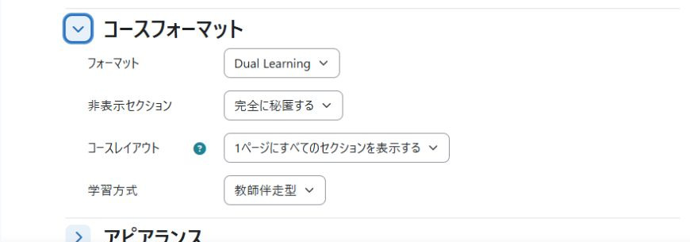

# Dual Learning course format

**Design for how learners are supported: by a teacher, or primarily by the course itself.**

Dual Learning helps learners find where to continue, where to ask for help,
and where to submit their work. It adds a focused overview above Moodle's
familiar Topics sections and helps authors build units for either
**Teacher guided** or **Self paced** learning. Choose the approach when starting
the course; preparation and revision are available in both.

Use the course during a supported class, then keep it available for practice
and revision afterwards. The materials, activities, submissions, and learning
records stay in the same course, so learners return to work they already know.

- **Give learners a clear starting point:** link to the first accessible,
  incomplete activity with completion tracking enabled, in course order.
- **Bring work and help closer together:** show external-tool links and, in
  guided mode, forums alongside assignment information.
- **Keep progress understandable:** distinguish materials marked complete from
  assignment submission and published-grade status.
- **Keep a consistent learning context:** select the course learning mode and retain
  materials and learning history for continued study and revision.

Component: `format_duallearning` · Moodle 5.2 · GPL v3 or later.
The current release, [0.1.0-alpha4](https://github.com/ozekihiroshi/moodle-format_duallearning/releases/tag/v0.1.0-alpha4),
is an alpha for evaluation.

## Design direction and current scope

Teacher-guided and primarily self-paced courses ask different things of their
materials. A teacher may explain, pace activities, and respond to difficulties
in a class; an independent learner needs those directions, explanations, and
recovery paths available in the course. Self-paced study can still include
support staff, questions, and teacher assessment.

Dual Learning's broader aim is to help course authors make these choices
explicit, reducing their design burden and the ambiguity learners encounter.
Switching modes and showing an overview are means to that end, not the whole
purpose. Reusing a course does not automatically make its materials suitable
for independent study.

**This alpha combines the learner overview with practical authoring support.**
Start with a mode-specific, editable outline; save a hidden draft; then add
explanations, practice questions, and submission activities using standard
Moodle forms. Reopen existing materials from one place and return directly to
their unit from activity and editing pages. Optional hints can be expanded when
needed; experienced authors can use the actions without reading them.

Readiness checks, a redesigned initial mode-selection screen, and assisted
changes between learning designs are not yet implemented. Standard activity
forms retain their usual settings. Reduced authoring effort has not yet been
measured with teachers or compared with Topics.

## Choose the learning design before authoring

Authors normally choose **Teacher guided** or **Self paced** when they begin
building the course and keep that direction throughout its use. The design
choice determines which explanations, feedback, and guidance the course must
provide and which support a teacher will supply.

Preparation and revision belong in both designs. A teacher-guided course can
support pre-class preparation and post-class review without switching modes.
Independent review of a lesson is not the same as a complete self-study course.
Completed materials and existing learning records remain useful for revisiting
and practising what has been learned.

Changing direction later is an exceptional redesign task. The current mode
selector changes the overview; it cannot make materials educationally suitable
for a different learning design. Planned change support will help authors
identify settings to check and content that needs human review.

The [learning-design specification (Japanese)](docs/LEARNING_DESIGN_SPEC.ja.md)
defines the requirements for mode-specific authoring support, learner follow-up,
preservation of preparation/revision paths, and exceptional design changes.
The specification includes future requirements as well as implemented work;
see the current scope above and the reviewer guide for this release.

## What the two modes do

| | Self paced | Teacher guided |
| --- | --- | --- |
| Intended use | Independent study, practice, and revision | Teacher-supported lessons and workshops |
| Overview emphasis | Review materials and continue your work | Current work and submissions |
| Next activity | First accessible incomplete activity with completion tracking, in course order | The same learner-specific next-activity guidance |
| Work links | Accessible external-tool / LTI activities, such as a Lab | The same external-tool links, plus accessible forums |
| Assignment information | Submission state, published-grade status, and base deadline | The same information, with standard assignment links for teacher review |
| Underlying course | Existing Topics sections, activities, and records | The same sections, activities, and records |

The teacher chooses one **Learning mode** for the whole course. It is not a
per-student mode selector. Both modes share the same overview foundation; the
guided mode changes its heading and adds forum shortcuts. Forums remain normal
course activities when the course is switched to self-paced mode.

## What learners and teachers gain

### A place to resume

The next-activity link uses the learner's existing Moodle completion state and
course order. Activities that Moodle makes unavailable to that learner are not
offered as actions. Completed materials remain in the course for revision.
Teachers control the sequence through normal course organisation and completion
settings; this is a continuation aid, not an adaptive learning recommendation.

### Reading, submitting, and being assessed are clearly separated

The materials count shows manually marked completion for activities other than
assignments. Assignment information is shown separately, including states such
as not submitted, draft, submitted, resubmission required, and a published grade.

A learner can therefore distinguish "I marked the reading complete" from "I
submitted the assignment". Opening the standard assignment page gives access
to submitted files, grades, and feedback. Teachers use the same assignment links
to review work through Moodle's normal controls.

### A familiar course, with less setup

Dual Learning inherits Moodle's standard Topics format. The overview sits above
the course sections rather than replacing them with a separate content system.
It uses existing activities and learning records and stores no additional
personal data.

The format works with standard Moodle themes, including Boost. The separate
Dual Learning theme is optional, and neither LessonMark nor a Python Lab is
required. An external tool is linked when an accessible LTI activity is present;
the format itself does not provide or manage the external service.

## Screenshots

These examples use Boost with Japanese interface text and demonstration
materials. The plugin includes English interface strings and a Japanese
translation. English-language demonstration screenshots are planned as a
separate documentation update; the current images are retained here.

### Self-paced learner overview

The learner sees where to continue, materials marked complete, work links,
and assignment information above the normal course sections.

### Teacher-guided learner overview

Forum shortcuts bring the course's help and discussion channels alongside
work links and submissions.

### Learning mode setting

Teachers switch the whole course through one setting, without installing
separate formats for the two modes.

## Requirements and installation

- Moodle 5.2 (`2026042000`).
- Moodle's standard Topics course format (`format_topics`).
- No external account, service, API key, or JavaScript build step is required
  by the format itself.

1. Download the installable ZIP from [GitHub Releases](https://github.com/ozekihiroshi/moodle-format_duallearning/releases).
2. Install through **Site administration > Plugins > Install plugins**, or place
   the extracted `duallearning` directory in `course/format/duallearning`.
3. Complete Moodle's standard plugin upgrade.
4. Edit a course and select **Dual Learning** as its course format.
5. Choose **Self paced** or **Teacher guided** under **Learning mode**, then save.

## Prepare a useful learner overview

1. Arrange sections and activities in the order learners should follow.
2. Enable course and activity completion tracking for activities that should
   contribute to the next-activity link. Use manual completion for materials
   learners should mark as reviewed.
3. Add assignments using Moodle's usual submission and grading settings.
4. For a guided course, add and clearly name a forum for questions. Guided work
   links include accessible forum activities; the format does not distinguish
   a question forum from other forum purposes or types.
5. Optionally add LTI activities for practical work. Accessible LTI activities
   appear as work links; no Python-specific LTI configuration is required by
   this format's link selection.
6. Check the course as a learner, including activity access restrictions.

If no accessible activities have completion tracking enabled, the overview
cannot provide a next-activity link. Moodle's course sections remain available.

## Switching modes and interpreting the overview

Changing **Learning mode** changes the overview. It does not copy activities or
rewrite completion, submissions, grades, deadlines, groups, restrictions, or
calendar events. It also does not rewrite course instructions: update any
teacher-dependent directions when moving to independent study.

The overview is read-only. Moodle activities remain authoritative for learning
and assessment:

- The materials count measures manual completion, not mastery or assignment
  acceptance. It excludes assignments and automatically tracked activities.
- Displayed deadlines are assignment base deadlines. Open the assignment to
  check individual overrides and extensions.
- Group submission details are delegated to the standard assignment page.
- Published-grade status is a summary; grades and feedback are read on the
  assignment page.

Switching **Learning mode** within Dual Learning is different from changing
**Course format** to another plugin. The latter uses Moodle's normal format
migration; back up production courses before structural format changes.

## Privacy

Dual Learning stores its course-level learning-mode option. It reads existing
Moodle data for the current request and stores no additional personal data.
The format does not send that data to an external service.

## Documentation and support

- [Simple authoring specification and first implementation scope (Japanese)](docs/SIMPLE_AUTHORING_SPEC.ja.md)

### Build and revise a unit

1. Choose the course learning mode and turn editing on.
2. Select **Start a unit from an outline**, give it a title, and adapt the text.
   Preparation, learning steps, help, and revision are part of the editable text,
   not extra mandatory fields.
3. Save the hidden draft. Use **Add an explanation**, **Add practice questions**,
   or **Collect submitted work** as needed. These open standard Moodle forms.
4. Use the existing-material links to revise content, settings, and quiz questions.
   **Back to unit authoring** returns to the same unit. Save form changes first.
5. Check the materials and use Moodle's normal visibility controls when ready.

Hints start collapsed and are optional. Visibility information and unsaved-form
reminders remain visible. This is an authoring aid, not an automatic course
builder or a replacement for activity settings. The outline is stored as a
standard section summary; activities, grading, and submissions remain standard.

Design documents for the next iteration (Japanese; not released features):

- [Review and resumption feature inventory](docs/REVIEW_FEATURE_INVENTORY.ja.md)
- [Unit authoring support: detailed design](docs/AUTHORING_DESIGN.ja.md)

- [Reviewer guide and functional checks](docs/REVIEWER_GUIDE.md)
- [Marketplace listing text](docs/MARKETPLACE_LISTING.md)
- [Screenshot details](docs/screenshots/README.md)
- [Change log](CHANGELOG.md)
- [Source code](https://github.com/ozekihiroshi/moodle-format_duallearning)
- [Issues](https://github.com/ozekihiroshi/moodle-format_duallearning/issues)
- [Security policy](SECURITY.md)

## Licence

Copyright 2026 Hiroshi Ozeki. Licensed under the GNU GPL v3 or later.
See [LICENSE](LICENSE).
